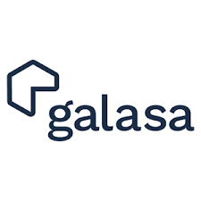
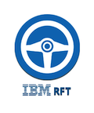
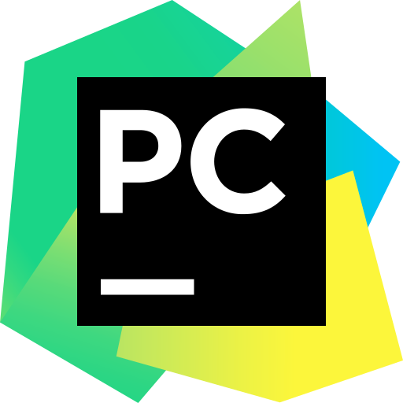

# Hi there! 👋

I'm a Software Quality Engineer interested in automation development, learning new technology trends, and helping others. I work on personal projects in my free time that facilitate my life.

- 🔭 I’m currently working on ... Java Selenium Framework
- 🌱 I’m currently learning ... JavaScript
- ⚡ Fun fact: ... like to read, bike and hiking 💻

##  My Technical Skills  

### OOP
[](https://skillicons.dev)
### 📚 Frameworks
[](https://skillicons.dev)



### Git / Repositories Experience
[](https://skillicons.dev)

### Web
[](https://skillicons.dev)
### 💾 Databases
[](https://skillicons.dev)


### IDE
[](https://skillicons.dev)


### Other
[](https://skillicons.dev)

## 🏆 My GitHub Stats:
<a href="https://github.com/edstgo/github-readme-stats">
    
</a>

<a href="https://github.com/edstgo/convoychat">
    
</a>


## 💡 A Quote:
```
I can not relate to lazy people. We do not speak the same language. I do not understand you. I do not want to understand you.
- Kobe Bryant
```
